<div align="center">

# 🚀 Next-Gen Event-Driven E-Commerce & AI Platform
### Enterprise DevOps, Platform Engineering & SRE Master Blueprint

[](https://kubernetes.io/)
[](https://www.terraform.io/)
[](https://kafka.apache.org/)
[](https://qdrant.tech/)
[](https://argoproj.github.io/)
[](https://golang.org/)
[-3776AB?logo=python&logoColor=white)](https://fastapi.tiangolo.com/)
[-339933?logo=nodedotjs&logoColor=white)](https://nodejs.org/)
[](LICENSE)

<p align="center">
  A production-grade, highly resilient microservices e-commerce platform built from scratch with modern <b>Event-Driven Architecture (Kafka)</b>, <b>AI Semantic Search (FastAPI + Qdrant RAG)</b>, <b>FinOps (Karpenter & Kubecost)</b>, <b>GitOps (ArgoCD & Argo Rollouts)</b>, and <b>Zero-Trust Security (Kyverno & ESO)</b>.
</p>

</div>

---

## 🏛️ System Architecture Overview

```mermaid
flowchart TB
    subgraph Clients["Clients & Edge"]
        User["Web / Mobile Clients"]
        Cloudflare["Cloudflare / Route 53 (DNS + WAF)"]
    end

    subgraph AWS_Cloud["AWS Cloud Infrastructure (Provisioned via Terraform)"]
        ALB["AWS Application Load Balancer (Ingress)"]

        subgraph EKS_Cluster["Amazon EKS Cluster (Kubernetes 1.30+)"]
            direction TB

            subgraph Security_Control["Policy & Secrets Control"]
                Kyverno["Kyverno (Admission Controller)"]
                ESO["External Secrets Operator"]
            end

            subgraph Microservices["Event-Driven Microservices"]
                AuthSvc["Auth Service (Go / JWT)"]
                ProductSvc["Product Catalog (Node.js)"]
                OrderSvc["Order Service (Go / Kafka)"]
                PaymentSvc["Payment Service (Go / Idempotency)"]
                AISvc["AI Semantic Search & RAG (FastAPI)"]
                FrontendStore["Storefront UI (Next.js)"]
            end

            subgraph Data_Events["Event Streaming & Data Layer"]
                Kafka["Apache Kafka (KRaft / Strimzi)"]
                Redis["Redis Sentinel (Caching)"]
                Postgres["CloudNativePG / Managed RDS"]
                VectorDB["Qdrant Vector DB (AI Embeddings)"]
            end

            subgraph Scaling_Finops["Autoscaling & FinOps"]
                Karpenter["Karpenter (Dynamic Spot/On-Demand Provisioning)"]
                KEDA["KEDA (Kafka Queue Autoscaler)"]
                Kubecost["Kubecost (Cost per Pod Tracking)"]
            end

            subgraph Observability_Mesh["Full-Stack Observability"]
                OTel["OpenTelemetry Collector"]
                Prometheus["Prometheus & Grafana"]
                Loki["Grafana Loki (Logs)"]
                Tempo["Grafana Tempo (Distributed Tracing)"]
            end

            subgraph GitOps_Engine["GitOps Engine"]
                ArgoCD["ArgoCD (App-of-Apps Pattern)"]
                ArgoRollouts["Argo Rollouts (Canary / Blue-Green)"]
            end
        end

        AWS_Secrets["AWS Secrets Manager"]
        AWS_S3["S3 (Terraform State & Backup)"]
        AWS_ECR["Amazon ECR (Signed Container Images)"]
    end

    User --> Cloudflare --> ALB --> EKS_Cluster
    ESO -.-> AWS_Secrets
    Kafka <--> OrderSvc & PaymentSvc & ProductSvc
    AISvc <--> VectorDB
    ArgoCD -.-> EKS_Cluster
```



---

## 🎯 Real-World Problems Solved

| Real-World Production Challenge | Our Platform Solution | Core Technology |
| :--- | :--- | :--- |
| **Flash Sale / Black Friday Traffic Spikes** | Asynchronous Kafka event streaming prevents database connection exhaustion and drops. | Apache Kafka (KRaft) |
| **Duplicate Payments & Network Timeouts** | Strict Idempotency Key pattern and Saga orchestration guarantee single charges. | Go + Redis Sentinel |
| **Dumb Keyword Search Failure** | AI-driven semantic search matches intent and meaning rather than exact text strings. | FastAPI + Qdrant Vector DB |
| **Skyrocketing AWS Cloud Bills** | Karpenter dynamically spins up EC2 Spot instances in 30s, slashing compute costs by 70–90%. | Karpenter + Kubecost |
| **High-Risk Production Deployments** | Automated canary analysis (5% -> 20% -> 100%) with automated rollbacks on HTTP 5xx spikes. | Argo Rollouts + Prometheus |
| **Secret Leaks & Root Container Vulnerabilities** | External Secrets Operator syncs secrets in-memory; Kyverno enforces non-root execution. | Kyverno + ESO |
| **Blind Spots in Distributed Systems** | End-to-end distributed tracing from browser click to database query. | OpenTelemetry + Grafana Tempo |

---

## 🗺️ 12-Phase Master Roadmap

- [x] **Phase 1: Enterprise Monorepo & Governance**
  - Trunk-Based Development workflow with short-lived atomic PRs.
  - Commit governance enforced via Commitlint and Husky (`feat:`, `fix:`, `chore:`).
  - Branch protection & path-based approval enforcement via `.github/CODEOWNERS`.
- [x] **Phase 2: DevSecOps CI Pipeline (Shift-Left Security)**
  - Pre-commit linters (`golangci-lint`, `ESLint`, `Ruff`).
  - Unit test coverage gates (minimum 80% threshold).
  - Multi-stage minimal non-root container builds (`USER 10001`).
  - Automated vulnerability scanning using Aquasecurity Trivy.
- [ ] **Phase 3: Supply Chain Integrity & Artifact Management**
  - Amazon ECR tag immutability.
  - Container cryptographic image signing via Cosign (SLSA Level 3).
  - Automated patching with Dependabot / Renovate.
- [ ] **Phase 4: Production-Grade IaC with Terraform**
  - Multi-AZ VPC (Public, Private, Database subnets) with NAT Gateway.
  - EKS v1.30+ cluster with OIDC and IAM Roles for Service Accounts (IRSA).
  - S3 remote state management with AES-256 encryption and DynamoDB locking.
- [ ] **Phase 5: Next-Gen FinOps with Karpenter & Kubecost**
  - Sub-minute dynamic EC2 node provisioning with Karpenter.
  - Spot instance orchestration with SQS interruption queues.
  - Pod-level cost attribution and budget threshold alerting.
- [ ] **Phase 6: Centralized Zero-Trust Secrets Management**
  - Zero plaintext secrets policy.
  - External Secrets Operator (ESO) syncing from AWS Secrets Manager.
  - Secret rotation strategies.
- [ ] **Phase 7: GitOps & Progressive Rollouts**
  - ArgoCD App-of-Apps architectural pattern.
  - Multi-environment Helm and Kustomize overlays.
  - Argo Rollouts canary deployments (5% -> 20% -> 100%) with automated rollback.
- [ ] **Phase 8: Event-Driven Microservices & Cloud-Native DBs**
  - Declarative Strimzi Kafka cluster and topics (`order.created`, `payment.completed`).
  - CloudNativePG (PostgreSQL Operator) with Point-in-Time Recovery (PITR).
  - Idempotent consumers and Dead Letter Queues (DLQ).
- [ ] **Phase 9: AI-Powered Copilot & Semantic Search Service**
  - FastAPI vector search microservice.
  - Qdrant Vector Database StatefulSet deployment.
  - KEDA queue-driven event autoscaler.
- [ ] **Phase 10: Full-Stack Observability**
  - OpenTelemetry (OTel) distributed tracing instrumentation.
  - Prometheus & Grafana golden signals dashboard (Latency, Traffic, Errors, Saturation).
  - Centralized log streaming with Grafana Loki and Tempo.
- [ ] **Phase 11: SRE, Chaos Engineering & Disaster Recovery**
  - Strict SLOs (99.9% availability, p95 < 300ms latency).
  - Chaos Mesh synthetic failure injections and self-healing validation.
  - Velero disaster recovery backup and restore to S3.
- [ ] **Phase 12: DevSecOps Admission Control & Least Privilege**
  - Kyverno Policy-as-Code admission controller.
  - Zero-Trust NetworkPolicies isolating sensitive services (e.g. Payment).

---

## 📁 Repository Structure

```
├── .github/
│   ├── workflows/             # GitHub Actions CI/CD workflows
│   └── CODEOWNERS             # Mandatory path-based code review rules
├── apps/                      # Microservices Source Code
│   ├── auth-service/          # Go 1.22 / JWT Authentication
│   ├── product-service/       # Node.js 20 / Product Catalog API
│   ├── order-service/         # Go 1.22 / Kafka Event Producer
│   ├── payment-service/       # Go 1.22 / Idempotent Payment Processor
│   ├── ai-search-service/     # Python 3.11 FastAPI / Qdrant RAG Engine
│   └── frontend-store/        # Next.js 14 / Modern Storefront UI
├── infra/                     # Infrastructure as Code (IaC)
│   └── terraform/
│       ├── environments/      # dev, staging, prod configurations
│       └── modules/           # Reusable modules: vpc, eks, karpenter, rds, s3_dynamodb
├── k8s/                       # Kubernetes Manifests & GitOps
│   ├── base/                  # Raw manifests (Kafka, Qdrant, Argo Rollouts)
│   ├── gitops/                # ArgoCD Root Application (App-of-Apps)
│   └── policies/              # Kyverno admission and NetworkPolicies
├── scripts/                   # Automation & Local Sandbox
│   ├── docker-compose.local.yml # Local data stack (Kafka, Redis, Postgres, Qdrant)
│   ├── local-setup.ps1        # Windows Kind K8s cluster setup
│   ├── local-setup.sh         # Linux/macOS Kind K8s cluster setup
│   └── seed-data.py           # Catalog & vector embeddings seeder
└── docs/                      # Technical Architecture, SLOs & Runbooks
```

---

## ⚡ Quickstart: Local Sandbox (Zero Cloud Cost)

### 1. Launch the Local Data & Event Infrastructure
```bash
# Start Kafka, Redis, PostgreSQL, and Qdrant locally
npm run local:up

# Check container health
docker ps
```

### 2. Access Local Dashboards
* **Kafka UI Dashboard**: http://localhost:8080
* **Qdrant Vector DB Console**: http://localhost:6333/dashboard

### 3. Seed Sample Products & Vector Embeddings
```bash
python scripts/seed-data.py
```

### 4. Run Microservices
```bash
# AI Semantic Search Service (FastAPI)
cd apps/ai-search-service && pip install -r requirements.txt && uvicorn src.main:app --reload --port 8085

# Product Service (Node.js)
cd apps/product-service && npm install && npm start

# Storefront UI (Next.js)
cd apps/frontend-store && npm install && npm run dev
```

---

## 🤝 Contribution & Governance Guidelines

1. **Trunk-Based Development**: All feature work is done on short-lived branches created from `main` (`feat/feature-name`).
2. **Conventional Commits**: Every commit message must adhere to the Conventional Commits specification:
   ```bash
   git commit -m "feat(service): brief description of change"
   ```
   * Allowed types: `feat`, `fix`, `docs`, `style`, `refactor`, `perf`, `test`, `build`, `ci`, `chore`.
3. **Mandatory Code Reviews**: Pull requests touching protected paths (`/apps/payment-service/`, `/infra/terraform/`) require review and approval from designated **CODEOWNERS** before merge.
