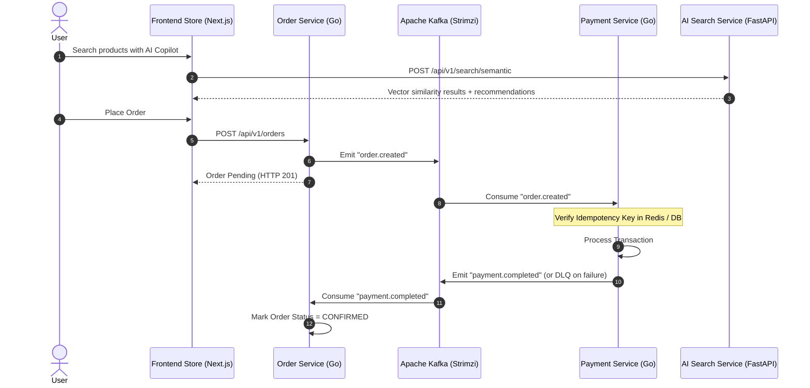

# Enterprise Architecture & SRE Specifications

## 1. Event-Driven Workflow (Order & Payment Saga)

---

## 2. Service Level Objectives (SLOs & SLIs)

| Service | Metric (SLI) | Target (SLO) | Window | Error Budget |
| :--- | :--- | :--- | :--- | :--- |
| **Edge API / ALB** | Availability (% successful HTTP non-5xx) | **99.9%** | Rolling 30 days | 0.1% (43.2 min downtime) |
| **AI Search API** | Latency (p95 response time) | **< 300 ms** | 7 days | 5% exceeding 300ms |
| **Order Service** | Transaction success rate | **99.95%** | Rolling 30 days | 0.05% |
| **Kafka Ingestion** | End-to-end event lag | **< 1000 ms** | 1 hour | < 1% spikes |

---

## 3. FinOps Strategy with Karpenter & Kubecost
- **Node Consolidation**: Karpenter dynamically analyzes unscheduled pods and launches right-sized EC2 instances within 30-45 seconds.
- **Spot Instance Target**: Stateless workloads (`apps/frontend-store`, `apps/ai-search-service`) utilize Spot instances configured with 90% cost savings, with automatic interruption handling via SQS queues.
- **Cost Allocation**: Kubecost tags each pod by namespace and service label to generate monthly microservice-level chargeback reports.

---

## 4. Zero-Trust Security Policies
- **Kyverno Admission Controller**: Blocks any pod without resource requests/limits, disallows privilege escalation, and enforces non-root execution (`runAsNonRoot: true`).
- **Network Isolation**: Payment service accepts inbound traffic exclusively from `order-service`, preventing unauthorized direct external access.
- **External Secrets Operator (ESO)**: Kubernetes secrets are dynamically synced from AWS Secrets Manager with zero plaintext secrets checked into source control.
